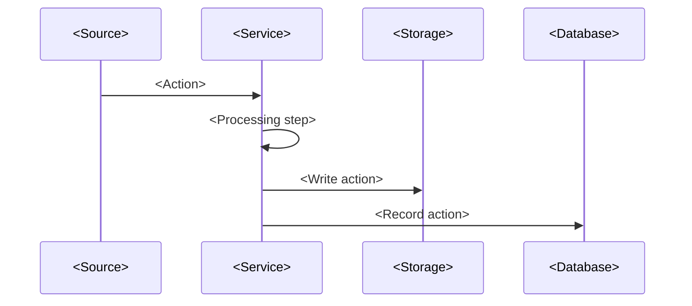
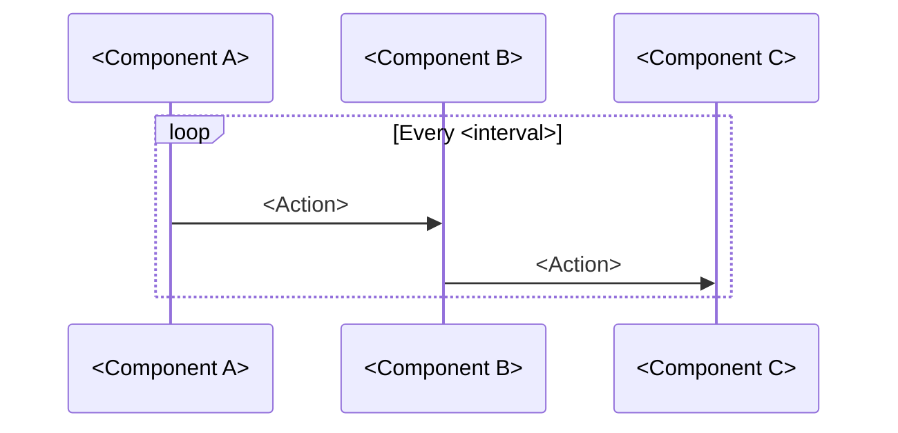

# Architecture

**Last Updated:** <YYYY-MM-DD>  
**Purpose:** System design and data flow for <Project Name>

---

## System Overview

<!-- Replace with your own ASCII or Mermaid diagram -->

```
┌─────────────────────────────────────────────────────────────────────────────────┐
│                              <PROJECT NAME>                                      │
├─────────────────────────────────────────────────────────────────────────────────┤
│                                                                                  │
│  ┌──────────────┐    ┌─────────────────┐    ┌──────────────────────────────────┐│
│  │   INPUT      │    │   PROCESSING    │    │       OUTPUT                     ││
│  │  (Source)    │───▶│   (Service)     │───▶│   (Destination)                  ││
│  └──────────────┘    └─────────────────┘    └──────────────────────────────────┘│
│        │                     │                              │                    │
│        │                     ▼                              ▼                    │
│        │             ┌───────────────┐              ┌───────────────┐           │
│        │             │   SERVICE     │              │   DATABASE    │           │
│        └────────────▶│   (Name)      │─────────────▶│   (Storage)   │           │
│                      └───────────────┘              └───────────────┘           │
│                                                                                  │
└─────────────────────────────────────────────────────────────────────────────────┘
```

---

## Data Flow

### 1. <Primary Flow Name>



### 2. <Secondary Flow Name>



---

## Module Structure

### Project Layout

```
<project-name>/
├── .cursor/                    # Memory Bank (AI context)
│   ├── memory/                 # Long-term context
│   └── active_sprint/          # Short-term state
├── <src>/                      # Source code
│   ├── <service-1>/            # <Service description>
│   │   ├── <main>.py           # Entry point
│   │   ├── <module>.py         # <Description>
│   │   ├── Dockerfile          # Container definition
│   │   └── tests/              # Test suite
│   ├── <service-2>/            # <Service description>
│   │   └── ...
│   └── <shared>/               # Common components
│       ├── models.py           # Data models
│       ├── database.py         # DB connection
│       └── tests/              # Shared tests
├── <infrastructure>/           # Infrastructure config
│   └── <config>/               # Docker, CI/CD, etc.
├── <input>/                    # Input directory (if applicable)
├── <output>/                   # Output directory (if applicable)
├── docs/                       # Documentation
├── requirements.txt            # Dependencies
└── README.md                   # Project overview
```

---

## Service Responsibilities

### <Service 1 Name>

**Purpose:** <One-line description>

**Responsibilities:**
- <Responsibility 1>
- <Responsibility 2>
- <Responsibility 3>

**Key Components:**
| Component | File | Purpose |
|-----------|------|---------|
| Entry Point | `<file>.py` | <Purpose> |
| <Module> | `<file>.py` | <Purpose> |
| <Module> | `<file>.py` | <Purpose> |

### <Service 2 Name>

**Purpose:** <One-line description>

**Responsibilities:**
- <Responsibility 1>
- <Responsibility 2>
- <Responsibility 3>

### Shared Components

**Purpose:** Reusable code across services

| Component | File | Purpose |
|-----------|------|---------|
| Models | `models.py` | Data model definitions |
| Database | `database.py` | Connection management |
| <Component> | `<file>.py` | <Purpose> |

---

## Database Schema

<!-- Link to canonical schema document or summarize here -->

### Tables

#### `<table_1>`
- **Purpose:** <Description>
- **Key Columns:** <List important columns>
- **Notes:** <Any special considerations>

#### `<table_2>`
- **Purpose:** <Description>
- **Key Columns:** <List important columns>
- **Notes:** <Any special considerations>

See `docs/<SCHEMA>.md` for canonical definitions.

---

## Design Patterns

### 1. <Pattern Name>
- <Description of the pattern>
- <Why it's used>
- <Where it's applied>

### 2. <Pattern Name>
- <Description of the pattern>
- <Why it's used>
- <Where it's applied>

### 3. <Pattern Name>
- <Description of the pattern>
- <Why it's used>
- <Where it's applied>

---

## Path Resolution

<Describe your path resolution strategy>

Example:
```python
# Good - relative to __file__
BASE_DIR = Path(__file__).parent.parent.parent
STORAGE_PATH = BASE_DIR / "Storage" / "Output"

# Bad - absolute paths (BANNED)
STORAGE_PATH = Path("/absolute/path")  # NEVER
```

Exception: <Any exceptions to the rule>

---

## Health & Monitoring

### Health Checks

| Service | Check Type | Interval |
|---------|------------|----------|
| <service-1> | <check type> | <interval> |
| <service-2> | <check type> | <interval> |

### Monitoring Strategy

<Describe how services are monitored, logged, and observed>

---

## Future Architecture (Planned)

<!-- Document planned architectural changes for future capabilities -->

```
┌──────────────────────────────────────────────────────────────────────────┐
│                        FUTURE SERVICES                                    │
├──────────────────────────────────────────────────────────────────────────┤
│                                                                           │
│  ┌────────────┐  ┌────────────┐  ┌────────────┐  ┌────────────┐         │
│  │ <Future    │  │ <Future    │  │ <Future    │  │ <Future    │         │
│  │ Service 1> │  │ Service 2> │  │ Service 3> │  │ Service 4> │         │
│  └────────────┘  └────────────┘  └────────────┘  └────────────┘         │
│                                                                           │
└──────────────────────────────────────────────────────────────────────────┘
```

---

**END OF ARCHITECTURE**

